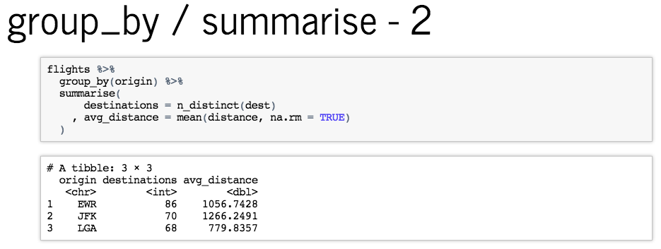

A lecture on the basics of exploratory data analysis using tidyverse as a TA for Wharton's Statistics Department's [STAT701 - Modern Data Mining](https://statistics.wharton.upenn.edu/programs/mba/course-descriptions/).

**Presentation**: [bit.ly/stats_eda](https://bit.ly/stats_eda)

Much of the material and examples is derived from 

- [R for Data Science](http://r4ds.had.co.nz/exploratory-data-analysis.html)
- [dplyr tutorial](https://cran.rstudio.com/web/packages/dplyr/vignettes/introduction.html)
- [gapminder ggplot tutorial](https://github.com/jennybc/ggplot2-tutorial/blob/master/gapminder-ggplot2-scatterplot.md)
- [ggplot to learn visualization](http://sharpsightlabs.com/blog/r-package-think-about-visualization/)
