<div class="footer" style="margin-top;">Intro to EDA: <a target="_blank" href = "bit.ly/stats_eda">bit.ly/stats_eda</a> | <a target="_blank" href = "bit.ly/stats_eda_code">bit.ly/stats_eda_code</a></div>
Exploratory Data Analysis
========================================================
author: Jordan Farrer
date: 2016-01-19
autosize: true
transition: rotate
css: jrf_style.css


Make Data Your BBF
========================================================

<center></center>

Agenda
========================================================

1. Role of EDA
2. tidyverse Fundamentals
3. EDA Examples

Role of EDA
====================================
type: sub-section

Data Analysis Lifecycle
========================================================

<center></center>

<small>Source: [r4ds.had.co.nz/](http://r4ds.had.co.nz/)</small>

What is EDA?
========================================================

**Exporatory Data Analysis** : ask questions, uncover features of your data, but no conclusive results

- Objective: know your data inside and out
- There is no right way
- It's a **creative process**
- Better questions → better understanding

Balancing Act
========================================================
left:40%

Data Integrity vs Data Understanding


***
|Role|More likely to ...|
|---|:---:|
|Engineer|Focus on data integrity|
|Statistician|Jump to complex, intricate questions|
|Data Scientist|Balance both|

Roadmap of Questions
========================================================

1. Data Integrity
  + Record counts
  + Missing values
  + Unusual values
2. Data Understanding
  + Variation
  + Covariation
      + Two Continuous Variables
      + One Continuous and One Categorical
      + Two Categorical
  + Patterns / Anomolies
  
  
tidyverse Fundamentals
====================================
type: sub-section

tidyverse
========================================================


```r
library(tidyverse)
```

<center></center>

[tidyverse](https://github.com/tidyverse/tidyverse) is a collection of R packages that share common philosophies and are designed to work together

- created mostly by Hadley Wickam and maintained by RStudio

R-God
========================================================

<center></center>

Packages Discussed Today
========================================================

**dplyr** : data manipulation

**ggplot2** : grammar of graphics

dplyr
========================================================


Set of simple *"verbs"* - functions that correspond to the most common data manipulation tasks 
- help you translate those thoughts into code
- purposefully constrains your options
- creates readable code (no guessing why you're doing that)

The Verbs
========================================================

|dplyr verb|SQL equivalent|Action|
|---|---|---|
|`filter()`|WHERE|Limit based on condition|
|`select()`|SELECT|Choose only certain variables|
|`distinct()`|DISTINCT|De-duplicate result-set|
|`arrange()`|ORDER BY|Order results|
|`rename()`|SELECT|Rename variables|
|`mutate()`|SELECT|Create new variable|
|`group_by()`|GROUP BY |Group rows|
|`summarise()`|SELECT|Create new variable in grouped setting|

Flights Data
========================================================


```r
library(nycflights13)

flights
```

```
# A tibble: 336,776 × 19
    year month   day dep_time sched_dep_time dep_delay arr_time
   <int> <int> <int>    <int>          <int>     <dbl>    <int>
1   2013     1     1      517            515         2      830
2   2013     1     1      533            529         4      850
3   2013     1     1      542            540         2      923
4   2013     1     1      544            545        -1     1004
5   2013     1     1      554            600        -6      812
6   2013     1     1      554            558        -4      740
7   2013     1     1      555            600        -5      913
8   2013     1     1      557            600        -3      709
9   2013     1     1      557            600        -3      838
10  2013     1     1      558            600        -2      753
# ... with 336,766 more rows, and 12 more variables: sched_arr_time <int>,
#   arr_delay <dbl>, carrier <chr>, flight <int>, tailnum <chr>,
#   origin <chr>, dest <chr>, air_time <dbl>, distance <dbl>, hour <dbl>,
#   minute <dbl>, time_hour <dttm>
```

Dataset
- 336,776 flights that departed from New York City in 2013
- From the [US Bureau of Transportation Statistics](http://www.transtats.bts.gov/DatabaseInfo.asp?DB_ID=120&Link=0)

filter - 1
========================================================


```r
flights %>%
  filter(month == 1 &  day == 1)
```

```
# A tibble: 842 × 19
    year month   day dep_time sched_dep_time dep_delay arr_time
   <int> <int> <int>    <int>          <int>     <dbl>    <int>
1   2013     1     1      517            515         2      830
2   2013     1     1      533            529         4      850
3   2013     1     1      542            540         2      923
4   2013     1     1      544            545        -1     1004
5   2013     1     1      554            600        -6      812
6   2013     1     1      554            558        -4      740
7   2013     1     1      555            600        -5      913
8   2013     1     1      557            600        -3      709
9   2013     1     1      557            600        -3      838
10  2013     1     1      558            600        -2      753
# ... with 832 more rows, and 12 more variables: sched_arr_time <int>,
#   arr_delay <dbl>, carrier <chr>, flight <int>, tailnum <chr>,
#   origin <chr>, dest <chr>, air_time <dbl>, distance <dbl>, hour <dbl>,
#   minute <dbl>, time_hour <dttm>
```


filter - 2
========================================================


```r
flights %>%
  filter(dest %in% c("PHL","SLC") & month <= 6)
```

```
# A tibble: 2,116 × 19
    year month   day dep_time sched_dep_time dep_delay arr_time
   <int> <int> <int>    <int>          <int>     <dbl>    <int>
1   2013     1     1      655            655         0     1021
2   2013     1     1      908            915        -7     1004
3   2013     1     1     1047           1050        -3     1401
4   2013     1     1     1245           1245         0     1616
5   2013     1     1     1323           1300        23     1651
6   2013     1     1     1543           1550        -7     1933
7   2013     1     1     1600           1610       -10     1712
8   2013     1     1     1909           1912        -3     2239
9   2013     1     1     1915           1920        -5     2238
10  2013     1     1     2000           2000         0     2054
# ... with 2,106 more rows, and 12 more variables: sched_arr_time <int>,
#   arr_delay <dbl>, carrier <chr>, flight <int>, tailnum <chr>,
#   origin <chr>, dest <chr>, air_time <dbl>, distance <dbl>, hour <dbl>,
#   minute <dbl>, time_hour <dttm>
```

select
========================================================


```r
flights %>%
  filter(dest %in% c("PHL","SLC") & month <= 6) %>%
  select(origin, dest, carrier)
```

```
# A tibble: 2,116 × 3
   origin  dest carrier
    <chr> <chr>   <chr>
1     JFK   SLC      DL
2     LGA   PHL      US
3     JFK   SLC      DL
4     JFK   SLC      DL
5     EWR   SLC      DL
6     JFK   SLC      DL
7     JFK   PHL      9E
8     JFK   SLC      B6
9     JFK   SLC      DL
10    JFK   PHL      9E
# ... with 2,106 more rows
```


distinct
========================================================


```r
flights %>%
  filter(dest %in% c("PHL","SLC") & month <= 6) %>%
  select(origin, dest, carrier) %>% 
  distinct()
```

```
# A tibble: 8 × 3
  origin  dest carrier
   <chr> <chr>   <chr>
1    JFK   SLC      DL
2    LGA   PHL      US
3    EWR   SLC      DL
4    JFK   PHL      9E
5    JFK   SLC      B6
6    EWR   PHL      EV
7    JFK   PHL      US
8    JFK   PHL      DL
```

arrange
========================================================


```r
flights %>%
  filter(dest %in% c("PHL","SLC") & month <= 6) %>%
  select(origin, dest, carrier) %>% 
  distinct() %>%
  arrange(origin, desc(dest), carrier)
```

```
# A tibble: 8 × 3
  origin  dest carrier
   <chr> <chr>   <chr>
1    EWR   SLC      DL
2    EWR   PHL      EV
3    JFK   SLC      B6
4    JFK   SLC      DL
5    JFK   PHL      9E
6    JFK   PHL      DL
7    JFK   PHL      US
8    LGA   PHL      US
```

rename
========================================================


```r
flights %>%
  filter(dest %in% c("PHL","SLC") & month <= 6) %>%
  select(origin, dest, carrier) %>% 
  distinct() %>%
  arrange(origin, desc(dest), carrier) %>%
  rename(airline = carrier)
```

```
# A tibble: 8 × 3
  origin  dest airline
   <chr> <chr>   <chr>
1    EWR   SLC      DL
2    EWR   PHL      EV
3    JFK   SLC      B6
4    JFK   SLC      DL
5    JFK   PHL      9E
6    JFK   PHL      DL
7    JFK   PHL      US
8    LGA   PHL      US
```

mutate
========================================================


```r
flights %>%
  mutate(
    gain = arr_delay - dep_delay
  , speed = distance / air_time * 60
  , gain_per_hour = gain / (air_time / 60)
  ) %>% 
  select(dep_delay, arr_delay, gain, distance, distance, air_time, speed, gain_per_hour)
```

```
# A tibble: 336,776 × 7
   dep_delay arr_delay  gain distance air_time    speed gain_per_hour
       <dbl>     <dbl> <dbl>    <dbl>    <dbl>    <dbl>         <dbl>
1          2        11     9     1400      227 370.0441      2.378855
2          4        20    16     1416      227 374.2731      4.229075
3          2        33    31     1089      160 408.3750     11.625000
4         -1       -18   -17     1576      183 516.7213     -5.573770
5         -6       -25   -19      762      116 394.1379     -9.827586
6         -4        12    16      719      150 287.6000      6.400000
7         -5        19    24     1065      158 404.4304      9.113924
8         -3       -14   -11      229       53 259.2453    -12.452830
9         -3        -8    -5      944      140 404.5714     -2.142857
10        -2         8    10      733      138 318.6957      4.347826
# ... with 336,766 more rows
```

group_by / summarise - 1
========================================================


```r
flights %>%
  group_by(origin) %>%
  summarise(
    n = n()
    , avg_delay = mean(dep_delay, na.rm = TRUE)
  )
```

```
# A tibble: 3 × 3
  origin      n avg_delay
   <chr>  <int>     <dbl>
1    EWR 120835  15.10795
2    JFK 111279  12.11216
3    LGA 104662  10.34688
```


summarise
========================================================


```r
flights %>%
  summarise(
    n = n()
    , destinations = n_distinct(dest)
    , avg_delay = mean(dep_delay, na.rm = TRUE)
  )
```

```
# A tibble: 1 × 3
       n destinations avg_delay
   <int>        <int>     <dbl>
1 336776          105  12.63907
```

group_by / summarise - 2
========================================================


```r
flights %>%
  group_by(origin) %>%
  summarise(
      destinations = n_distinct(dest)
    , avg_distance = mean(distance, na.rm = TRUE)
  )
```

```
# A tibble: 3 × 3
  origin destinations avg_distance
   <chr>        <int>        <dbl>
1    EWR           86    1056.7428
2    JFK           70    1266.2491
3    LGA           68     779.8357
```

group_by / summarise - 3
========================================================

What is the farthest flight to leave NYC?


```r
flights %>%
  group_by(origin, dest) %>%
  summarise(
      n = n()
    , min = min(distance)
    , max = max(distance)
    , median = median(distance)
  ) %>%
  arrange(desc(median))
```

```
Source: local data frame [224 x 6]
Groups: origin [3]

   origin  dest     n   min   max median
    <chr> <chr> <int> <dbl> <dbl>  <dbl>
1     JFK   HNL   342  4983  4983   4983
2     EWR   HNL   365  4963  4963   4963
3     EWR   ANC     8  3370  3370   3370
4     JFK   SFO  8204  2586  2586   2586
5     JFK   OAK   312  2576  2576   2576
6     JFK   SJC   329  2569  2569   2569
7     EWR   SFO  5127  2565  2565   2565
8     JFK   SMF   284  2521  2521   2521
9     JFK   LAX 11262  2475  2475   2475
10    JFK   BUR   371  2465  2465   2465
# ... with 214 more rows
```

ggplot2
========================================================

- [Grammar of Graphics](https://www.amazon.com/Grammar-Graphics-Statistics-Computing/dp/0387245448) : abstraction of how to build visual stories with data
- Forget powerpoint or excel

ggplot2 Examples - 1
========================================================

<center><center>

ggplot2 Examples - 2
========================================================

<center><center>

ggplot2 Examples - 3
========================================================

<center><center>

ggplot2 Examples - 4
========================================================

<center><center>

ggplot2 Examples - 5
========================================================

<center><center>

Basic Structure
========================================================

`ggplot(data, aes(x = *, y = *)) + geom_***`


```r
ggplot(data = mtcars, mapping = aes(x = hp, y = mpg)) +
  geom_point()
```

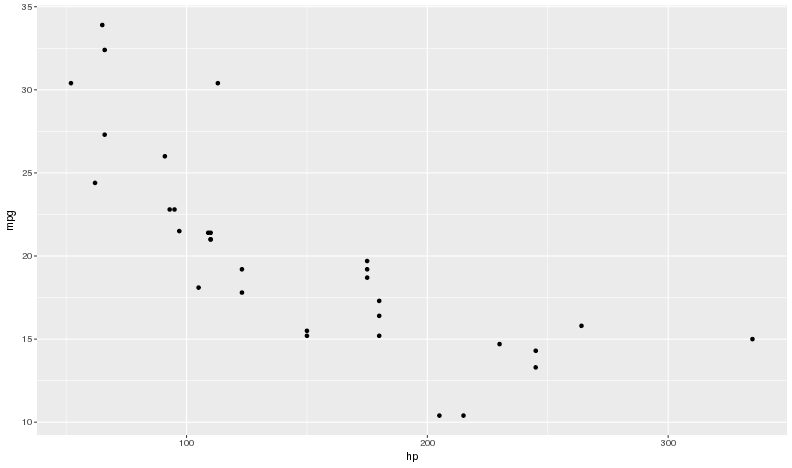

Fundemental Concept
========================================================

**Geometric objects** (geom_\*) have **aesthetic attributes** (aes(x = \*, color = \*))

When we visualize data we **MAP** our data to aesethics.

<center></center>

Common Geoms
========================================================

- geom_point
- geom_bar
- geom_boxplot
- geom_histogram
- geom_line
- geom_smooth

See documentation ([docs.ggplot2.org/current](http://docs.ggplot2.org/current)) for more

Common Aesthetics
========================================================

- x
- y
- colour
- fill
- alpha
- size
- shape

geom_bar
========================================================


```r
ggplot(diamonds, aes(x = cut)) +
  geom_bar()
```


geom_point with colour
========================================================


```r
ggplot(diamonds, aes(x = carat, y = price, colour = cut)) +
  geom_point() +
  labs(title = "Diamonds Dataset", subtitle = "Carat vs Price")
```


Example EDA
====================================
type: sub-section

1. Data Integrity Checks
2. Intricate Questions

Look at the Data
====================================


```r
flights
```

```
# A tibble: 336,776 × 19
    year month   day dep_time sched_dep_time dep_delay arr_time
   <int> <int> <int>    <int>          <int>     <dbl>    <int>
1   2013     1     1      517            515         2      830
2   2013     1     1      533            529         4      850
3   2013     1     1      542            540         2      923
4   2013     1     1      544            545        -1     1004
5   2013     1     1      554            600        -6      812
6   2013     1     1      554            558        -4      740
7   2013     1     1      555            600        -5      913
8   2013     1     1      557            600        -3      709
9   2013     1     1      557            600        -3      838
10  2013     1     1      558            600        -2      753
# ... with 336,766 more rows, and 12 more variables: sched_arr_time <int>,
#   arr_delay <dbl>, carrier <chr>, flight <int>, tailnum <chr>,
#   origin <chr>, dest <chr>, air_time <dbl>, distance <dbl>, hour <dbl>,
#   minute <dbl>, time_hour <dttm>
```

Data has **336776** rows and **19** columns using:

`` `r nrow(flights)` `` and `` `r ncol(flights)` ``

Missing Values
====================================


```r
flights %>%
  filter(!complete.cases(.))
```

```
# A tibble: 9,430 × 19
    year month   day dep_time sched_dep_time dep_delay arr_time
   <int> <int> <int>    <int>          <int>     <dbl>    <int>
1   2013     1     1     1525           1530        -5     1934
2   2013     1     1     1528           1459        29     2002
3   2013     1     1     1740           1745        -5     2158
4   2013     1     1     1807           1738        29     2251
5   2013     1     1     1939           1840        59       29
6   2013     1     1     1952           1930        22     2358
7   2013     1     1     2016           1930        46       NA
8   2013     1     1       NA           1630        NA       NA
9   2013     1     1       NA           1935        NA       NA
10  2013     1     1       NA           1500        NA       NA
# ... with 9,420 more rows, and 12 more variables: sched_arr_time <int>,
#   arr_delay <dbl>, carrier <chr>, flight <int>, tailnum <chr>,
#   origin <chr>, dest <chr>, air_time <dbl>, distance <dbl>, hour <dbl>,
#   minute <dbl>, time_hour <dttm>
```


```r
sapply(flights, function(x) sum(is.na(x))) 
```

```
          year          month            day       dep_time sched_dep_time 
             0              0              0           8255              0 
     dep_delay       arr_time sched_arr_time      arr_delay        carrier 
          8255           8713              0           9430              0 
        flight        tailnum         origin           dest       air_time 
             0           2512              0              0           9430 
      distance           hour         minute      time_hour 
             0              0              0              0 
```

Summary of Columns
====================================


```r
flights %>%
  select(1:10) %>%
  summary
```

```
      year          month             day           dep_time   
 Min.   :2013   Min.   : 1.000   Min.   : 1.00   Min.   :   1  
 1st Qu.:2013   1st Qu.: 4.000   1st Qu.: 8.00   1st Qu.: 907  
 Median :2013   Median : 7.000   Median :16.00   Median :1401  
 Mean   :2013   Mean   : 6.549   Mean   :15.71   Mean   :1349  
 3rd Qu.:2013   3rd Qu.:10.000   3rd Qu.:23.00   3rd Qu.:1744  
 Max.   :2013   Max.   :12.000   Max.   :31.00   Max.   :2400  
                                                 NA's   :8255  
 sched_dep_time   dep_delay          arr_time    sched_arr_time
 Min.   : 106   Min.   : -43.00   Min.   :   1   Min.   :   1  
 1st Qu.: 906   1st Qu.:  -5.00   1st Qu.:1104   1st Qu.:1124  
 Median :1359   Median :  -2.00   Median :1535   Median :1556  
 Mean   :1344   Mean   :  12.64   Mean   :1502   Mean   :1536  
 3rd Qu.:1729   3rd Qu.:  11.00   3rd Qu.:1940   3rd Qu.:1945  
 Max.   :2359   Max.   :1301.00   Max.   :2400   Max.   :2359  
                NA's   :8255      NA's   :8713                 
   arr_delay          carrier         
 Min.   : -86.000   Length:336776     
 1st Qu.: -17.000   Class :character  
 Median :  -5.000   Mode  :character  
 Mean   :   6.895                     
 3rd Qu.:  14.000                     
 Max.   :1272.000                     
 NA's   :9430                         
```

Unusual Values
====================================


```r
ggplot(flights, aes(x = air_time)) +
  geom_histogram()
```


Gapminder Dataset
====================================

Gapminder is a non-profit in Stockholm, Sweden that puts out data on development metrics


```r
library(gapminder)
gapminder
```

```
# A tibble: 1,704 × 6
       country continent  year lifeExp      pop gdpPercap
        <fctr>    <fctr> <int>   <dbl>    <int>     <dbl>
1  Afghanistan      Asia  1952  28.801  8425333  779.4453
2  Afghanistan      Asia  1957  30.332  9240934  820.8530
3  Afghanistan      Asia  1962  31.997 10267083  853.1007
4  Afghanistan      Asia  1967  34.020 11537966  836.1971
5  Afghanistan      Asia  1972  36.088 13079460  739.9811
6  Afghanistan      Asia  1977  38.438 14880372  786.1134
7  Afghanistan      Asia  1982  39.854 12881816  978.0114
8  Afghanistan      Asia  1987  40.822 13867957  852.3959
9  Afghanistan      Asia  1992  41.674 16317921  649.3414
10 Afghanistan      Asia  1997  41.763 22227415  635.3414
# ... with 1,694 more rows
```

Data Integrity - 1
====================================

Check for missing data


```r
gapminder %>%
  filter(!complete.cases(.))
```

```
# A tibble: 0 × 6
# ... with 6 variables: country <fctr>, continent <fctr>, year <int>,
#   lifeExp <dbl>, pop <int>, gdpPercap <dbl>
```

Data Integrity - 2
====================================

Do all the countries have the same number of years?


```r
gapminder %>% 
  group_by(country) %>% 
  summarise(years_per_country = n()) %>%
  group_by(years_per_country) %>%
  summarise(countries = n())
```

```
# A tibble: 1 × 2
  years_per_country countries
              <int>     <int>
1                12       142
```

Data Integrity - 3
====================================

What years are included in the dataset?


```r
gapminder %>%
  distinct(year)
```

```
# A tibble: 12 × 1
    year
   <int>
1   1952
2   1957
3   1962
4   1967
5   1972
6   1977
7   1982
8   1987
9   1992
10  1997
11  2002
12  2007
```

Data Integrity - 4
====================================


```r
  gapminder %>%
    group_by(continent) %>%
    summarize(n_obs = n(), n_countries = n_distinct(country)) %>%
    mutate(years = n_obs / n_countries)
```

```
# A tibble: 5 × 4
  continent n_obs n_countries years
     <fctr> <int>       <int> <dbl>
1    Africa   624          52    12
2  Americas   300          25    12
3      Asia   396          33    12
4    Europe   360          30    12
5   Oceania    24           2    12
```


Data Integrity - 5
====================================

What is the median life expectancy for each continent in 2007 (last year)?


```r
gapminder %>%
  filter(year == 2007) %>%
  group_by(continent) %>%
  summarise(lifeExp = median(lifeExp))
```

```
# A tibble: 5 × 2
  continent lifeExp
     <fctr>   <dbl>
1    Africa 52.9265
2  Americas 72.8990
3      Asia 72.3960
4    Europe 78.6085
5   Oceania 80.7195
```

Data Integrity - 6
====================================

Basic summary


```r
gapminder %>%
  summary()
```

```
        country        continent        year         lifeExp     
 Afghanistan:  12   Africa  :624   Min.   :1952   Min.   :23.60  
 Albania    :  12   Americas:300   1st Qu.:1966   1st Qu.:48.20  
 Algeria    :  12   Asia    :396   Median :1980   Median :60.71  
 Angola     :  12   Europe  :360   Mean   :1980   Mean   :59.47  
 Argentina  :  12   Oceania : 24   3rd Qu.:1993   3rd Qu.:70.85  
 Australia  :  12                  Max.   :2007   Max.   :82.60  
 (Other)    :1632                                                
      pop              gdpPercap       
 Min.   :6.001e+04   Min.   :   241.2  
 1st Qu.:2.794e+06   1st Qu.:  1202.1  
 Median :7.024e+06   Median :  3531.8  
 Mean   :2.960e+07   Mean   :  7215.3  
 3rd Qu.:1.959e+07   3rd Qu.:  9325.5  
 Max.   :1.319e+09   Max.   :113523.1  
                                       
```

Plots by Data Types
===

|Data|Plots|
|----|---|
|One Continuous|Histogram|
|One Continuous + One Categorical|Boxplot|
|Two Continuous|Scatter Plot|
|Three Continuous|Scatter Plot + Size|
|Two Continuous + One Categorical|Scatter Plot + Color|
|Categorical with *reasonable number of levels*|Faceting!!|

Note: Time is always the x-axis.

One Continuous
===

<p class = "question_master">What is the distribution of life expectancy in 2007?</p>


```r
gapminder %>%
  filter(year == 2007) %>%
  ggplot(aes(x = lifeExp)) +
  geom_histogram(binwidth = 2)
```

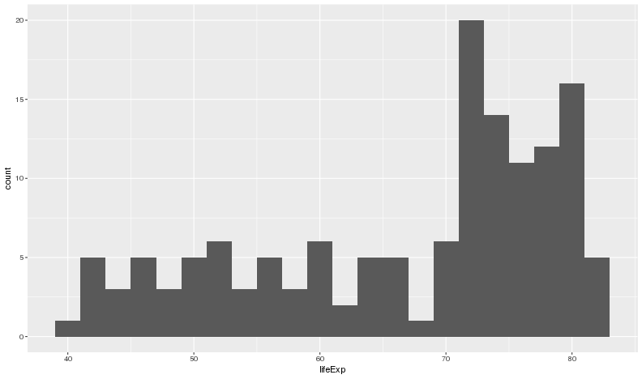


One Continuous + One Categorical
===

<p class = "question_master">What is the distribution of life expectancy in 2007 by continent?</p>


```r
gapminder %>%
  filter(year == 2007) %>%
  ggplot(aes(x = continent, y = lifeExp)) +
  geom_boxplot()
```

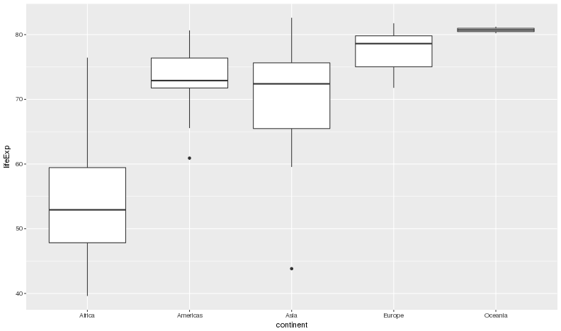

Who are the Outliers?
===


```r
gapminder %>%
  filter(year == 2007 & continent %in% c("Americas","Asia")) %>%
  group_by(continent) %>%
  filter(rank(lifeExp) == 1)
```

```
Source: local data frame [2 x 6]
Groups: continent [2]

      country continent  year lifeExp      pop gdpPercap
       <fctr>    <fctr> <int>   <dbl>    <int>     <dbl>
1 Afghanistan      Asia  2007  43.828 31889923  974.5803
2       Haiti  Americas  2007  60.916  8502814 1201.6372
```

Two Continuous
===

<p class = "question_master">What is the relationship between GDP per capita and life expectancy?</p>


```r
gapminder %>%
  ggplot(aes(x = gdpPercap, y = lifeExp)) + 
  geom_point()
```


Let's log that!!
===

<p class = "question_master">Relationship is clearer</p>


```r
gapminder %>%
  ggplot(aes(x = gdpPercap, y = lifeExp)) + 
  geom_point() +
  scale_x_log10()
```

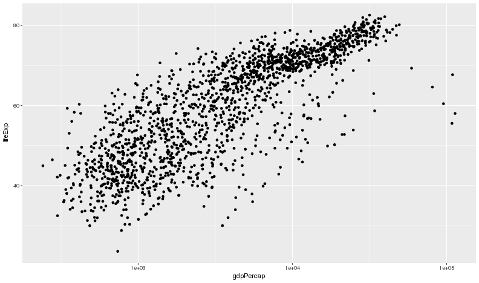

Two Continuous + One Categorical (few)
===

<p class = "question_master">What is the relationship between GDP per capita and life expectancy by continent?</p>


```r
gapminder %>%
  ggplot(aes(x = gdpPercap, y = lifeExp, colour = continent)) + 
  geom_point() +
  scale_x_log10()
```

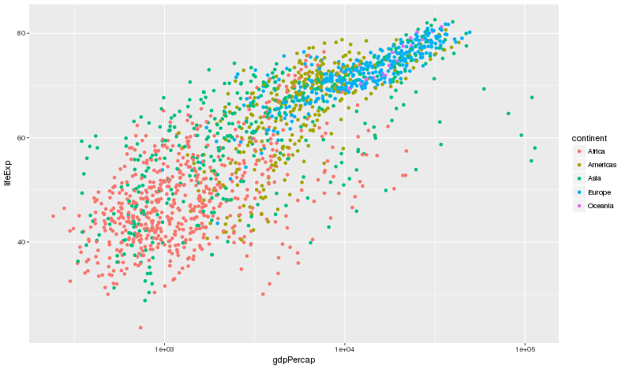

Two Continuous + One Categorial (many)
===

<p class = "question_master">What is the relationship between GDP per capita and life expectancy over time?</p>


```r
gapminder %>%
  ggplot(aes(x = gdpPercap, y = lifeExp, colour = year)) + 
  geom_point() +
  scale_x_log10()
```

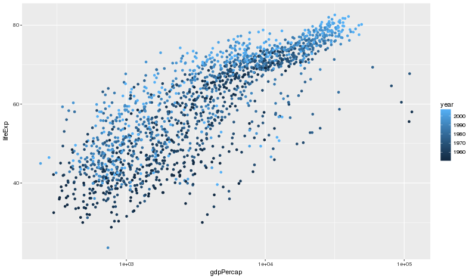

Three Continuous
===

<p class = "question_master">What is the relationship between GDP per capita, life expectancy, and population in 2007?</p>


```r
gapminder %>%
  filter(year == 2007) %>%
  ggplot(aes(x = gdpPercap, y = lifeExp, size = pop)) + 
  geom_point() +
  scale_x_log10()
```

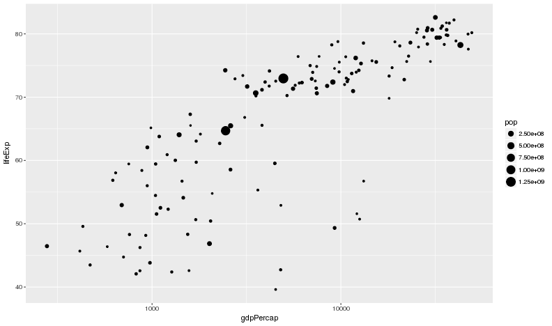

One Continuous + One Categorical (Time)
===

<p class = "question_master">What does the distribution of life expectancy look like by continent?</p>


```r
gapminder %>%
  ggplot(aes(x = year, y = lifeExp, colour = continent)) +
  geom_point() # position = 'jitter'
```

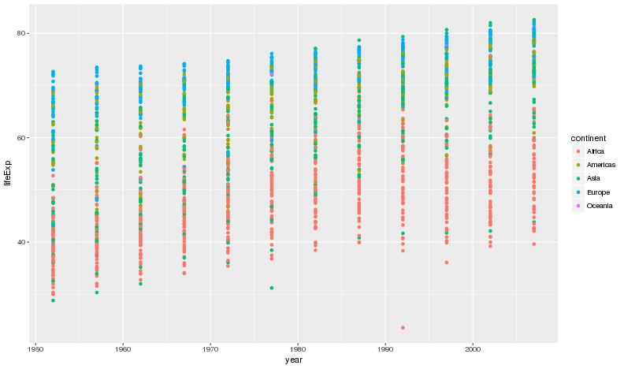

Let's Facet!
===

<center></center>

One Continuous + Two Categorical
===

<p class = "question_master">What does the distribution of life expectancy look like by continent?</p>


```r
gapminder %>%
  ggplot(aes(x = year, y = lifeExp)) +
  geom_point() +
  geom_smooth(method = 'loess', se = FALSE) + 
  facet_wrap(~ continent)
```

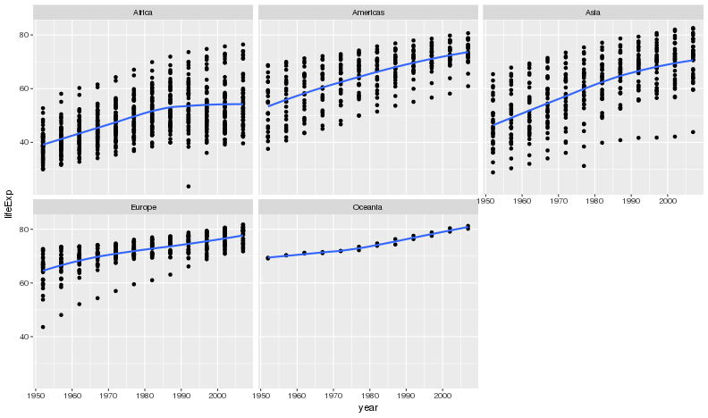

Data Integrity (again)
===

<p class = "question_master">Who is Oceania?</p>


```r
gapminder %>%
  filter(continent == "Oceania") %>%
  distinct(country)
```

```
# A tibble: 2 × 1
      country
       <fctr>
1   Australia
2 New Zealand
```

Data Integrity (again)
===

<p class = "question_master">What if we included them as Asia?</p>


```r
gapminder %>%
  mutate(continent = forcats::fct_recode(continent, Asia = "Oceania")) %>%
  ggplot(aes(x = year, y = lifeExp)) +
  geom_point() +
  geom_smooth(method = 'loess', se = FALSE) + 
  facet_wrap(~ continent)
```

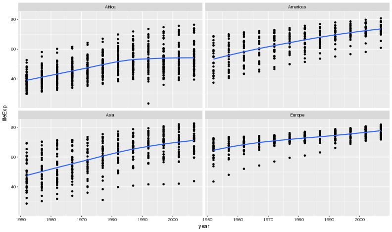

One Continuous + Two Categorical
===

<p class = "question_master">What if we wanted line charts instead?</p>


```r
gapminder %>%
  ggplot(aes(x = year, y = lifeExp)) +
  geom_point(alpha = 2/3) +
  geom_line(aes(group = country), alpha = 1/3) +
  geom_smooth(method = 'loess', se = FALSE) + 
  facet_wrap(~ continent)
```

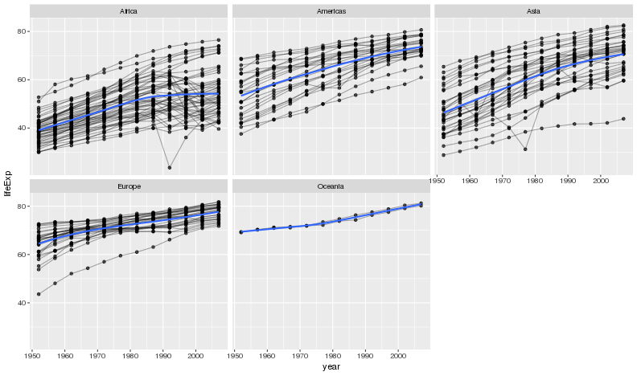

One Continuous + One Categorical
===

<p class = "question_master">What is the distribution of life expectancy (in 2007) by continent? (non-boxplot</p>


```r
gapminder %>%
  filter(year == 2007) %>%
  ggplot(aes(x = lifeExp)) +
  geom_histogram(binwidth = 2) +
  facet_wrap(~ continent)
```


Two Continuous + Two Categorical
===

<p class = "question_master">What is the relationship between GDP per capita and life expectancy across continents and time?</p>


```r
gapminder %>%
  ggplot(aes(x = gdpPercap, y = lifeExp, colour = continent, alpha = year)) + 
  geom_point() + 
  scale_x_log10()
```

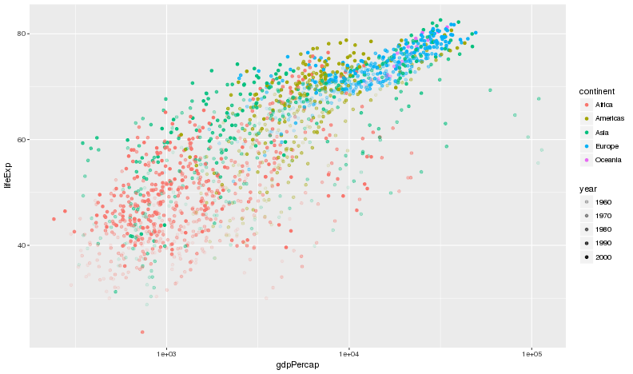

Add in Regression Line
===


```r
gapminder %>%
  ggplot(aes(x = gdpPercap, y = lifeExp, colour = continent)) + 
  geom_point(aes(alpha = year)) + 
  geom_smooth(method = 'lm', se = FALSE) + 
  scale_x_log10()
```

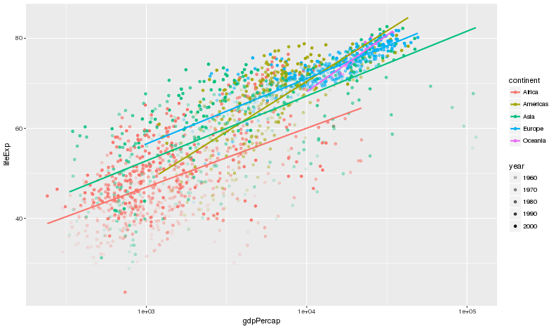

Linear Model for Each Year and Continent
====


```r
gapminder %>%
  filter(country != "Kuwait") %>%
  ggplot(aes(x = gdpPercap, y = lifeExp, colour = continent)) + 
  geom_point() + 
  geom_smooth(method = 'lm', se = FALSE) + 
  facet_wrap(~ year) + 
  scale_x_log10()
```

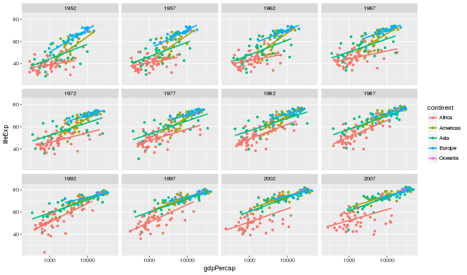

Particular Observations
===

<p class = "question_master">Are there any trends in particular countries over time?</p>


```r
gapminder %>%
  filter(country %in% c("Canada", "Rwanda", "Cambodia", "Mexico", "Zimbabwe")) %>%
  ggplot(aes(x = year, y = lifeExp, colour = country)) + 
  geom_point() + 
  geom_line() +
  labs(title = "Sad Evidence of Human Conflict")
```

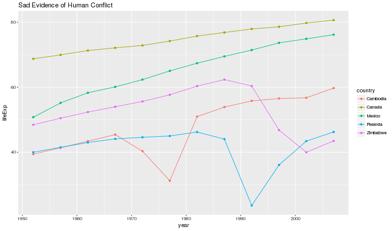

Let's end on a positive note
===

<p class = "question_master">How is the distribution of life expectancy evolving over time?</p>


```r
gapminder %>%
  ggplot(aes(x = factor(year), y = lifeExp)) +
  geom_boxplot() +
  labs(x = "year")
```

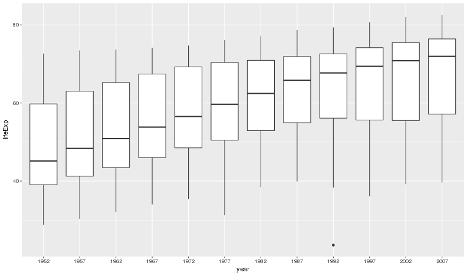

References
========================================================
type: sub-section

[R for Data Science](http://r4ds.had.co.nz/exploratory-data-analysis.html)

[dplyr tutorial](https://cran.rstudio.com/web/packages/dplyr/vignettes/introduction.html)

[gapminder ggplot tutorial](https://github.com/jennybc/ggplot2-tutorial/blob/master/gapminder-ggplot2-scatterplot.md)

[ggplot to learn visualization](http://sharpsightlabs.com/blog/r-package-think-about-visualization/)
